# GoodWe SEC1000/S Integration for Home Assistant

[](https://github.com/hacs/integration)
[](https://github.com/jozef-moravcik-homeassistant/goodwe-sec1000s/releases)
[](LICENSE)

Home Assistant Integration for GoodWe Smart Energy Controller SEC1000/S

---

## 📋 Table of Contents

- [Overview](#-overview)
- [Installation](#-installation)
- [Configuration](#-configuration)
- [Sensors](#-sensors)
- [Control Entities](#-control-entities)
- [Services](#-services)
- [Feedback Sensors](#-feedback-sensors)
- [Support](#-support)

---

## 🎯 Overview

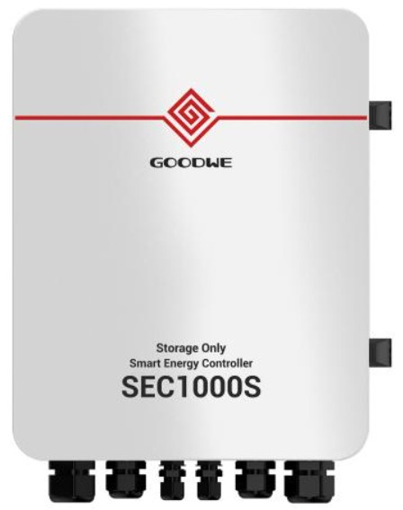

The **GoodWe SEC1000/S Integration** provides comprehensive control and monitoring capabilities for the GoodWe Smart Energy Controller. This integration allows you to:

- ⚡ **Control power export** to the grid with configurable limits
- 📊 **Monitor real-time telemetry data** from your solar system
- 🔒 **Enhance cybersecurity** by operating SEC1000 offline from SEMS Portal via Home Assistant
- ⏰ **Synchronize device time** with Home Assistant
- 🔄 **Automate energy management** using Home Assistant automations

### 🌟 Key Features

- **Real-time monitoring** of voltage, current, and power on all three phases
- **Export power limit control** with multiple control modes (VALUE, DRED, RCR)
- **Automatic data refresh** with configurable intervals
- **Multiple device support** - connect several SEC1000 devices simultaneously
- **Comprehensive feedback system** for monitoring communication status
- **Multi-language support** (English, Slovak)

### 📚 Official Documentation

For detailed information about the GoodWe SEC1000/S device, please refer to:
- [GoodWe Official Website](https://www.goodwe.com/)
- [SEC1000 Product Page](https://www.goodwe.com/product-detail/smart_energy_management)
- [GoodWe Technical Support](https://www.goodwe.com/support)

### ⚠️ Disclaimer

**The use of this integration is at your own risk.** Any potential damage caused by the integration is the responsibility of the user. The current version is tested and stable, running on multiple production systems for over 8 months.

---

## 💾 Installation

### Method 1: HACS (Recommended)

1. Open **HACS** in your Home Assistant instance
2. Click on **Integrations**
3. Click the **⋮** menu and select **Custom repositories**
4. Add the repository URL: `https://github.com/jozef-moravcik-homeassistant/goodwe-sec1000s`
5. Select category: **Integration**
6. Click **Add**
7. Search for **GoodWe SEC1000/S** in HACS
8. Click **Download**
9. Restart Home Assistant

### Method 2: Manual Installation

1. Download the latest release from [GitHub Releases](https://github.com/jozef-moravcik-homeassistant/goodwe-sec1000s/releases)
2. Extract the `goodwe_sec1000` folder
3. Copy the folder to your Home Assistant `custom_components` directory:
   ```
   <config>/custom_components/goodwe_sec1000/
   ```
4. Restart Home Assistant

### Adding the Integration

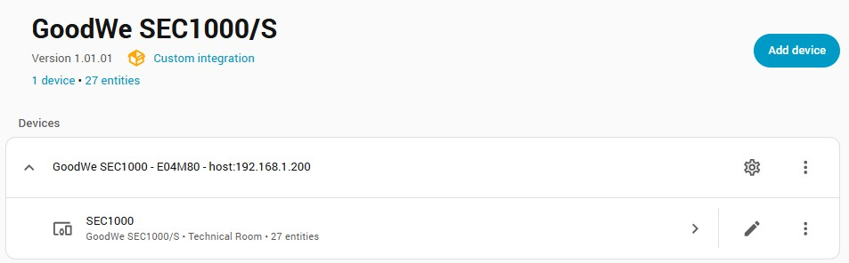

1. Go to **Settings** → **Devices & Services**
2. Click **+ Add Integration**
3. Search for **GoodWe SEC1000/S**
4. Follow the configuration steps (see [Configuration](#-configuration) section)

⏳ **Important:** After saving the configuration, the integration needs approximately **30 seconds** to synchronize with the device. During this time:
- Control entities will become available
- All sensors will load with correct values
- The device will be fully initialized

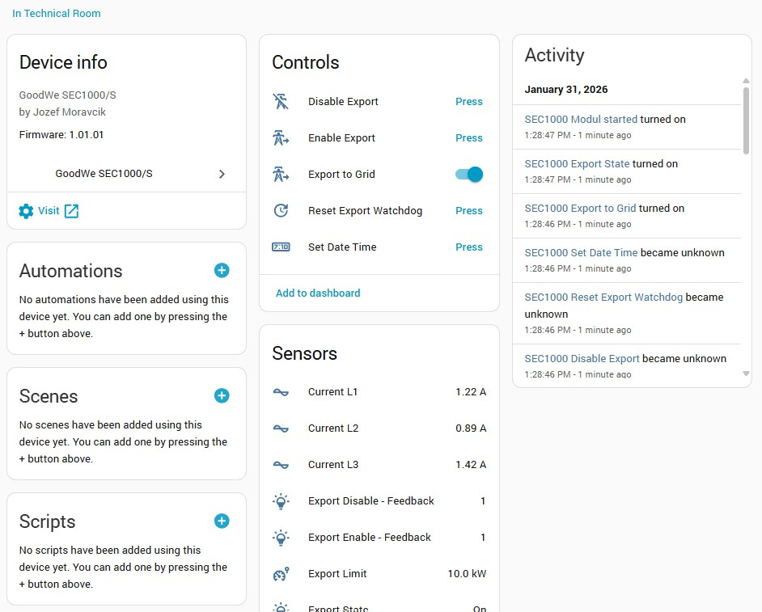

---

## ⚙️ Configuration

The integration supports **multiple SEC1000 devices** connected simultaneously. Each device can have its own unique name and settings.

### Configuration Step 1: Connection Settings

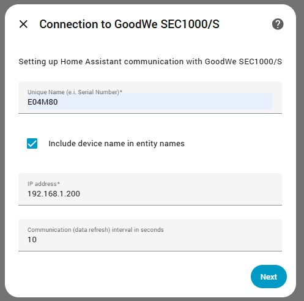

Configure the basic connection parameters:

#### 🔌 Parameters

| Parameter | Description | Default | Notes |
|-----------|-------------|---------|-------|
| **Unique Name** | Unique device identifier (e.g., Serial Number) | Device 1 | Used to distinguish multiple devices |
| **Include device name in entity** | Add device name as prefix to entity names | ✓ Enabled | See [Sensors](#-sensors) section |
| **IP Address** | SEC1000 device IP address | 192.168.1.200 | Default IP per GoodWe documentation |
| **Scan Interval** | Data refresh interval in seconds | 30 | Minimum recommended: 5 seconds |

⚠️ **Important Notes:**
- **IP Address**: According to GoodWe installation guide, the default IP should be `192.168.1.200`
- **Scan Interval**: Do not set below 5 seconds! Too short intervals may cause the device to stop communicating or return invalid packets. If communication fails, increase the interval and restart the SEC1000 hardware.

### Configuration Step 2: Export Power Limits

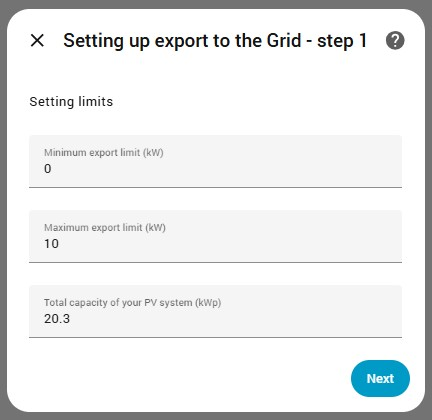

Define the power export limits for your system:

#### ⚡ Parameters

| Parameter | Description | Range | Default |
|-----------|-------------|-------|---------|
| **Minimum Export Limit** | Lower limit for export control (kW) | 0.00 - 100.00 | 0.00 |
| **Maximum Export Limit** | Upper limit for export control (kW) | 0.00 - 100.00 | 10.00 |
| **Total Capacity** | Total installed PV system capacity (kWp) | 0.00 - 100.00 | 10.00 |

💡 **Usage:**
- **Minimum Export Limit**: Used when calling `export_disable` service (typically 0 kW)
- **Maximum Export Limit**: Used when calling `export_enable` service
- **Total Capacity**: Required by SEC1000 for its power limitation algorithm. While it may seem like a statistical value, the device actively uses it in calculations.

### Configuration Step 3: Export Control Settings

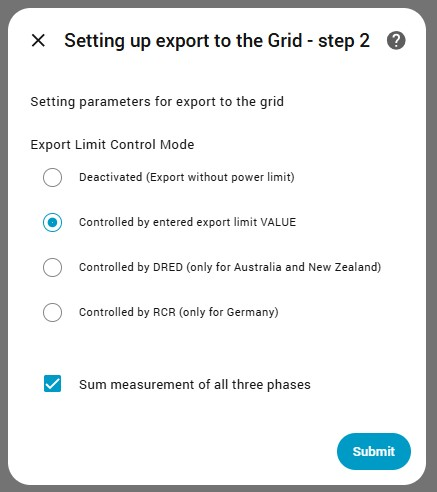

Configure how the export power limitation is controlled:

#### 🎛️ Parameters

| Parameter | Description | Options |
|-----------|-------------|---------|
| **Export Limit Control Mode** | Method of export power control | See table below |
| **Sum Measurement of All Three Phases** | How SEC1000 measures power flow | ☐ Separate phases<br>☑ Sum of all phases |

#### Export Limit Control Modes

| Mode | Value | Description | Region |
|------|-------|-------------|--------|
| **Deactivated** | 0 | No power limitation | ⚠️ Full PV power to grid |
| **Controlled by VALUE** | 3 | Manual limit value control | 🌍 Central Europe (Default) |
| **Controlled by DRED** | 1 | Demand Response Enabling Device | 🇦🇺 Australia, New Zealand |
| **Controlled by RCR** | 2 | Ripple Control Receiver | 🇩🇪 Germany |

⚠️ **Warning:** Deactivating power limitation will cause **full photovoltaic energy** to be exported to the grid immediately! This may violate your grid connection agreement.

#### Three-Phase Measurement Modes

- **Separate phases (unchecked)**: SEC1000 measures each phase independently
- **Sum of all phases (checked)**: SEC1000 measures total power across all three phases

For more details, refer to the GoodWe SEC1000 documentation.

### Configuration Changes

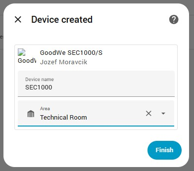

You can modify the configuration at any time:

1. Go to **Settings** → **Devices & Services**
2. Find **GoodWe SEC1000/S** integration
3. Click **Configure**
4. Update the desired parameters
5. Click **Submit**

🔄 The integration will automatically apply new settings to the device without interrupting sensor values.

---

## 📊 Sensors

The integration provides comprehensive telemetry data through multiple sensors.

### Voltage Sensors (Phase 1, 2, 3)

- **Entity IDs**: `sensor.sec1000_v1`, `sensor.sec1000_v2`, `sensor.sec1000_v3`
- **Unit**: V (Volts)
- **Description**: Phase voltage measurements

### Current Sensors (Phase 1, 2, 3)

- **Entity IDs**: `sensor.sec1000_i1`, `sensor.sec1000_i2`, `sensor.sec1000_i3`
- **Unit**: A (Amperes)
- **Description**: Phase current measurements

### Power Sensors (Phase 1, 2, 3)

- **Entity IDs**: `sensor.sec1000_p1`, `sensor.sec1000_p2`, `sensor.sec1000_p3`
- **Unit**: W (Watts)
- **Description**: Phase power measurements

### System Power Sensors

| Sensor | Entity ID | Unit | Description |
|--------|-----------|------|-------------|
| **Meter Power** | `sensor.sec1000_meters_power` | W | Power measured at the utility meter |
| **Inverter Power** | `sensor.sec1000_inverters_power` | W | Total power from all inverters |
| **Load Power** | `sensor.sec1000_load_power` | W | Power consumption (appliances + battery) |

### Control Status Sensors

| Sensor | Entity ID | Description |
|--------|-----------|-------------|
| **Export Limit** | `sensor.sec1000_export_limit` | Current export power limit (kW) |
| **Export State** | `sensor.sec1000_export_state` | Export status: ON (enabled) / OFF (disabled) |
| **Module Started** | `sensor.sec1000_modul_started` | Integration initialization status |

### Device Name Prefix in Entity Names

The integration allows you to display the device name as a prefix in entity names. This is particularly useful when managing **multiple SEC1000 devices**.

#### ✅ With Device Name Prefix (Enabled)

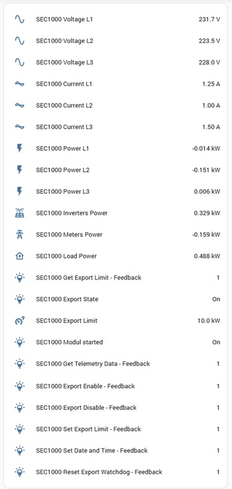

When **"Include device name in entity"** is **enabled** in configuration:
- Entity names include device name: `sensor.sec1000_device_1_v1`
- Useful for distinguishing entities from multiple devices
- Recommended when using 2+ SEC1000 devices

#### ❌ Without Device Name Prefix (Disabled)

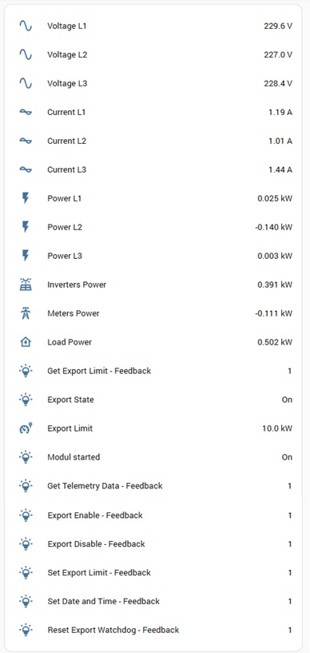

When **"Include device name in entity"** is **disabled** in configuration:
- Entity names are shorter: `sensor.sec1000_v1`
- Cleaner appearance in UI
- Recommended for single device installations

---

## 🎮 Control Entities

The integration provides several control entities for managing export power and device settings.

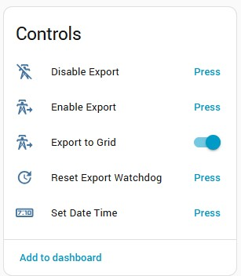

### 🔘 Switch Entity

#### Export to Grid Switch

- **Entity ID**: `switch.sec1000_export_to_grid`
- **Type**: Switch
- **Description**: Quick toggle for export enable/disable
- **States**:
  - **ON**: Export enabled (uses Maximum Export Limit)
  - **OFF**: Export disabled (uses Minimum Export Limit)

### 🔴 Button Entities

#### Enable Export Button

- **Entity ID**: `button.sec1000_export_enable`
- **Action**: Sets export limit to **Maximum Export Limit**
- **Icon**: `mdi:transmission-tower-export`

#### Disable Export Button

- **Entity ID**: `button.sec1000_export_disable`
- **Action**: Sets export limit to **Minimum Export Limit**
- **Icon**: `mdi:transmission-tower-off`

#### Reset Export Watchdog Button

- **Entity ID**: `button.sec1000_reset_export_watchdog`
- **Action**: Resets the export power limitation watchdog
- **Icon**: `mdi:update`
- **Description**: See [Reset Export Watchdog](#reset-export-watchdog-experimental) section for details

⚠️ **Warning:** This is an experimental feature. Use with caution!

#### Set Date and Time Button

- **Entity ID**: `button.sec1000_set_datetime`
- **Action**: Synchronizes device time with Home Assistant
- **Icon**: `mdi:clock-digital`
- **Recommendation**: Create an automation to sync time daily

---

## 🛠️ Services

The integration provides several services for advanced control and automation.

### 🚫 Export Disable (`export_disable`)

Disables power export by setting the limit to the **Minimum Export Limit** value configured in settings.

**Service**: `goodwe_sec1000.export_disable`

**Parameters**: None (uses configuration values)

**Example: Button Card**

```yaml
type: button
show_name: true
show_icon: true
name: Export OFF
icon: mdi:transmission-tower-off
tap_action:
  action: call-service
  service: goodwe_sec1000.export_disable
```

### ✅ Export Enable (`export_enable`)

Enables power export by setting the limit to the **Maximum Export Limit** value configured in settings.

**Service**: `goodwe_sec1000.export_enable`

**Parameters**: None (uses configuration values)

**Example: Button Card**

```yaml
type: button
show_name: true
show_icon: true
name: Export ON
icon: mdi:transmission-tower-export
tap_action:
  action: call-service
  service: goodwe_sec1000.export_enable
```

### ⚡ Set Export Limit (`set_export_limit`)

Sets a custom export power limit value.

**Service**: `goodwe_sec1000.set_export_limit`

**Parameters**:
- `limit` (float, required): Export limit in kW (0.00 - 100.00)

**Example: Button with Specific Limit (7 kW)**

```yaml
type: button
show_name: true
show_icon: true
name: 7.0 kW
icon: mdi:transmission-tower
tap_action:
  action: call-service
  service: goodwe_sec1000.set_export_limit
  service_data:
    limit: 7
grid_options:
  columns: 3
  rows: 2
  icon_height: 50px
```

**Example: Slider Control**

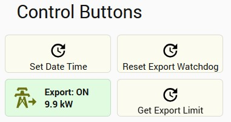

```yaml
type: vertical-stack
cards:
  - type: entities
    entities:
      - entity: sensor.sec1000_export_limit
        name: Current Export Limit
      - entity: input_number.export_limit
        icon: mdi:transmission-tower-export
        name: Export Limit
    footer:
      type: buttons
      entities:
        - entity: script.set_export_limit
          icon: mdi:check
          name: Apply
          tap_action:
            action: call-service
            service: goodwe_sec1000.set_export_limit
            data:
              limit: "{{ states('input_number.export_limit') | float }}"
```

### 📖 Get Export Limit (`get_export_limit`)

Reads the current export limit and control mode values from the device and updates the integration settings.

**Service**: `goodwe_sec1000.get_export_limit`

**Parameters**: None

**Usage**: Typically called automatically, but can be used in automations for manual refresh.

### 🕐 Set Date and Time (`set_datetime`)

Synchronizes the device's date and time with Home Assistant's system time.

**Service**: `goodwe_sec1000.set_datetime`

**Parameters**: None

**Recommendation**: Create a daily automation to ensure time consistency.

**Example: Automation**

```yaml
automation:
  - alias: "SEC1000 Daily Time Sync"
    trigger:
      - platform: time
        at: "03:00:00"
    action:
      - service: goodwe_sec1000.set_datetime
```

### 🔄 Reset Export Watchdog (Experimental)

Resets the export power limitation control algorithm in the inverter.

**Service**: `goodwe_sec1000.reset_export_watchdog`

**Parameters**: None

#### What is the Export Watchdog?

The Export Watchdog is a power limitation management mechanism that runs on some inverters. Under certain conditions, it can cause suboptimal behavior:

**Problem Scenario:**
1. Load increases sharply above export limit (e.g., water heater turns on)
2. Inverter significantly reduces power drawn from solar panels for 2-3 minutes
3. During this time, all power is drawn from the battery
4. After few minutes, inverter gradually returns to normal operation

**Consequences:**
- Unnecessary battery drain
- Reduced battery lifetime
- Disrupted charging process

#### How Reset Watchdog Works

When called, this service:
1. ⏸️ Completely disables power limit for **5 seconds**
2. 🔄 After 5 seconds, restores original settings
3. ✅ Restarts the power limit control algorithm in inverter
4. ⚡ Inverter immediately resumes full power from panels

#### ⚠️ Critical Safety Warning

**This method disables the power limit completely for 5 seconds!**

**Risks:**
- If SEC1000 stops communicating during these 5 seconds
- Power limit cannot be restored
- System will export **full power to grid**
- May exceed reserved capacity from grid operator
- Possible sanctions and penalties

**Requirements for Safe Use:**
1. ✅ Implement additional control mechanisms
2. ✅ Monitor communication status continuously
3. ✅ Have backup safety systems in place
4. ✅ Fully understand the implications

**Use at your own risk!** No equipment damage has been observed, but communication failures can have serious consequences.

### UI Control Examples

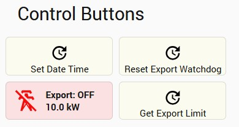

**Example: Multi-Button Control Panel**

```yaml
type: grid
cards:
  - type: button
    name: Export OFF
    icon: mdi:transmission-tower-off
    tap_action:
      action: call-service
      service: goodwe_sec1000.export_disable
  
  - type: button
    name: 3 kW
    icon: mdi:transmission-tower
    tap_action:
      action: call-service
      service: goodwe_sec1000.set_export_limit
      service_data:
        limit: 3
  
  - type: button
    name: 5 kW
    icon: mdi:transmission-tower
    tap_action:
      action: call-service
      service: goodwe_sec1000.set_export_limit
      service_data:
        limit: 5
  
  - type: button
    name: 7 kW
    icon: mdi:transmission-tower
    tap_action:
      action: call-service
      service: goodwe_sec1000.set_export_limit
      service_data:
        limit: 7
  
  - type: button
    name: Export MAX
    icon: mdi:transmission-tower-export
    tap_action:
      action: call-service
      service: goodwe_sec1000.export_enable
  
  - type: button
    name: Sync Time
    icon: mdi:clock-digital
    tap_action:
      action: call-service
      service: goodwe_sec1000.set_datetime

columns: 3
square: false
```

---

## 📡 Feedback Sensors

The integration provides comprehensive feedback sensors that monitor the communication status with the device. These sensors enable implementation of additional control mechanisms, protection systems, and visual effects for UI elements.

### Available Feedback Sensors

| Sensor | Entity ID | Description |
|--------|-----------|-------------|
| **Export Disable Feedback** | `sensor.sec1000_export_disable_feedback` | Status of export disable command |
| **Export Enable Feedback** | `sensor.sec1000_export_enable_feedback` | Status of export enable command |
| **Set Export Limit Feedback** | `sensor.sec1000_set_export_limit_feedback` | Status of set export limit command |
| **Get Export Limit Feedback** | `sensor.sec1000_get_export_limit_feedback` | Status of get export limit command |
| **Get Telemetry Data Feedback** | `sensor.sec1000_get_telemetry_data_feedback` | Status of telemetry data retrieval |
| **Reset Export Watchdog Feedback** | `sensor.sec1000_reset_export_watchdog_feedback` | Status of watchdog reset command |
| **Set Date Time Feedback** | `sensor.sec1000_set_datetime_feedback` | Status of time synchronization |

### Feedback Value Structure

All feedback sensors use a **bitmap value** with the same structure. Multiple flags can be combined (bitwise OR).

| Value | Hex | Name | Description |
|-------|-----|------|-------------|
| **0** | 0x00 | `FEEDBACK_NONE` | ⏳ **Waiting** - Waiting for response from device |
| **1** | 0x01 | `FEEDBACK_OK` | ✅ **Success** - Communication completed successfully |
| **2** | 0x02 | `FEEDBACK_GENERAL_ERROR` | ⚠️ **General Error** - Data processing error |
| **4** | 0x04 | `FEEDBACK_UNKNOWN_ERROR` | ❌ **Unknown Error** - Check Home Assistant logs |
| **8** | 0x08 | `FEEDBACK_COMMUNICATION_ERROR_TIMEOUT` | ⏱️ **Timeout** - Device did not respond in time |
| **16** | 0x10 | `FEEDBACK_COMMUNICATION_ERROR_UNEXPECTED_PACKET` | 📦 **Unexpected Packet** - Device sent invalid response |
| **32** | 0x20 | `FEEDBACK_COMMUNICATION_ERROR_CRC` | 🔢 **CRC Error** - Data integrity check failed |
| **64** | 0x40 | `FEEDBACK_COMMUNICATION_ERROR_SOCKET` | 🔌 **Socket Error** - Network connection issue |
| **128** | 0x80 | `FEEDBACK_INVALID_INPUT_PARAMETER` | 📊 **Invalid Parameter** - Input value out of range |

### Interpreting Feedback Values

#### Success State
```
Value: 1 (0x01)
Status: ✅ OK
```
Command executed successfully.

#### Timeout Error
```
Value: 8 (0x08)
Status: ⏱️ TIMEOUT
```
Device did not respond within expected time. Check network connection.

#### Unexpected Packet Error
```
Value: 16 (0x10)
Status: 📦 UNEXPECTED_PACKET
```
**Cause**: Device cannot process too many packets in short intervals.

**Solution**: 
1. Increase scan interval in configuration
2. Reduce automation frequency
3. Restart SEC1000 hardware if problem persists

#### Parameter Corrected
```
Value: 129 (0x81) = 0x01 | 0x80
Status: ✅ OK + 📊 INVALID_PARAMETER
```
Command succeeded, but input parameter was corrected to stay within configured limits.

**Example**: Setting export limit to 15 kW when maximum is 10 kW:
- Command executes with limit = 10 kW
- Feedback value = 129 (OK + INVALID_PARAMETER)

### Using Feedback Sensors in Automations

**Example: Visual Feedback for Button Press**

```yaml
type: custom:button-card
entity: button.sec1000_export_enable
name: Enable Export
icon: mdi:transmission-tower-export
tap_action:
  action: call-service
  service: goodwe_sec1000.export_enable
state:
  - value: "{{ states('sensor.sec1000_export_enable_feedback') == '0' }}"
    color: orange
    icon: mdi:progress-upload
  - value: "{{ states('sensor.sec1000_export_enable_feedback') == '1' }}"
    color: green
    icon: mdi:check-circle
  - value: "{{ states('sensor.sec1000_export_enable_feedback') | int > 1 }}"
    color: red
    icon: mdi:alert-circle
```

**Example: Communication Error Alert**

```yaml
automation:
  - alias: "SEC1000 Communication Error Alert"
    trigger:
      - platform: template
        value_template: >
          {{ states('sensor.sec1000_get_telemetry_data_feedback') | int > 1 }}
    action:
      - service: notify.mobile_app
        data:
          title: "SEC1000 Communication Error"
          message: >
            Error code: {{ states('sensor.sec1000_get_telemetry_data_feedback') }}
            Please check device connection.
```

---

## 💬 Support

### 🐛 Issues and Bug Reports

If you encounter any problems or bugs, please report them on [GitHub Issues](https://github.com/jozef-moravcik-homeassistant/goodwe-sec1000s/issues).

When reporting an issue, please include:
- Home Assistant version
- Integration version
- SEC1000 firmware version
- Detailed description of the problem
- Relevant log entries from Home Assistant

### 📖 Documentation

- [Full Documentation](https://github.com/jozef-moravcik-homeassistant/goodwe-sec1000s)
- [GoodWe Official Documentation](https://www.goodwe.com/)
- [Home Assistant Community Forum](https://community.home-assistant.io/)

### 🤝 Contributing

Contributions are welcome! Please feel free to submit a Pull Request.

### 📄 License

This project is licensed under the MIT License - see the [LICENSE](LICENSE) file for details.

### 👨‍💻 Author

**Jozef Moravčík**
- Email: jozef.moravcik@moravcik.eu
- GitHub: [@jozef-moravcik-homeassistant](https://github.com/jozef-moravcik-homeassistant)

---

### ⭐ If you find this integration useful, please consider giving it a star on GitHub!

---

**Tested and running on production systems for 8+ months** ✅
